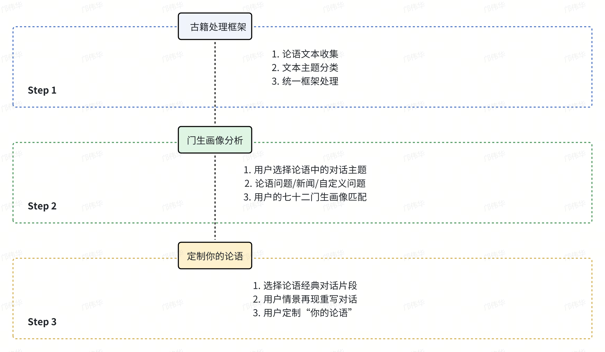
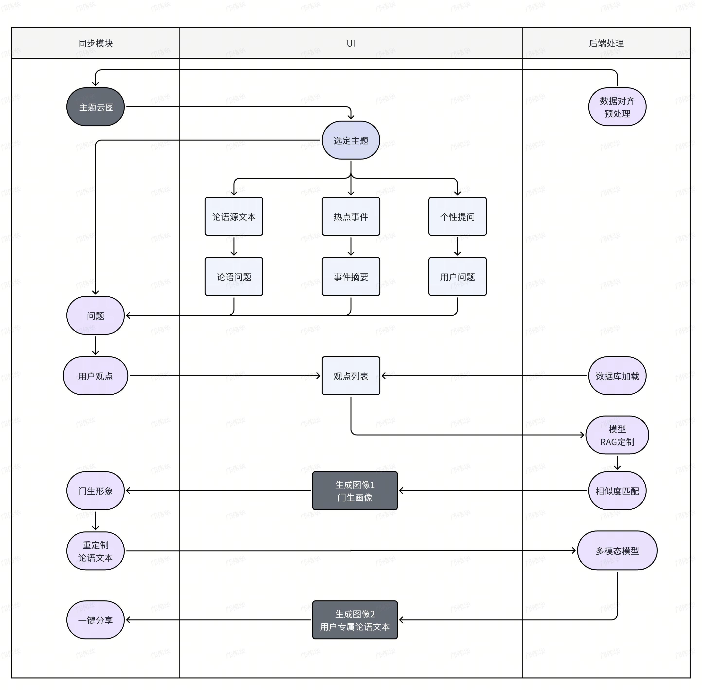

# Lunyu Type Indicator

## 项目背景

《论语》哲学影响深远，是每个人根植的古文素养。但是现代场景距离古语的语境与文言文法较远，有没有一种方法让我们设身处地回到论语的场景，参与孔子与门生的讨论？哪怕没法用文言回答，但只要有自己的观点，就可以获得独属于自己的论语语录。一番论语场景游历，最终生成自己的论语画像。借由新世代喜欢用 MBTI 刻画个人性格特征，并逐渐成为一个重要的社交分享属性，我们生成简易分享的论语 TI，全民参与到自己的论语性格特征生成，每个人都是孔子的 **"第七十三门生"** 。

借由"AI+高校创智计划"的机会，选择内容赛道命题方向 1 ：AI+中国优秀传统文化：典籍动起来。借助 AI 技术活化《论语》哲学及传统典籍，使之生动互动，复现孔子与门生的对话场景，代入用户作为 **"第七十三门生"** ，生成自己的论语人格与定制单独属于自己的论语语录，使用户在沉浸式互动中深切感悟中国文化的独特韵味与哲学智慧，彰显中华民族的文化自信与创新精神。

## 功能概述





## 项目部署

下载项目文件夹，下述介绍以 /Lunyu 指代项目文件夹

### 后端

涉及到的命令行终端指令都在 **/** **Lunyu 文件夹目录**下运行

```Python
cd /Lunyu
```

1. ## Python 环境

（建议使用 venv/conda 新建项目专门的虚拟环境）

```Python
pip install -r requirements.txt
```

2. ## Ollama 模型部署

官网下载安装 Ollama （Platform：Windows/Linux）

```Python
https://ollama.com/download
```

启动 Ollama

```Python
ollama serve
```

加载 Qwen2.5 模型 ( 默认 7B )

```Python
ollama pull qwen2.5

"""
如果更换 0.5b 版本
ollama pull qwen2.5:0.5b
"""
```

基准模型定制名为 Lunyu 的模型

```Python
ollama create Lunyu -f model\ollama\ModelFile

"""
如果更换模型版本
将 ModelFile 中 'FROM Qwen2.5'
修改为指定模型，如 'FROM Qwen2.5:0.5b'
"""
```

（可选）运行 Lunyu 模型简单对话测试

```Python
ollama run Lunyu
```

3. ## Redis 数据库

官网安装下载 Redis

```Python
https://redis.io/downloads/
```

（可选） Redis-insight 官方可视化管理工具

```Python
https://redis.io/insight/
```

数据库中数据初始化，确保 db=5 为空

```Python
python3 code\redis_data_load\redis_import.py
```

### 前端

官网下载安装微信开发者工具（稳定版 Stable Build）

```Python
https://developers.weixin.qq.com/miniprogram/dev/devtools/download.html
```

启动微信开发者工具，选择小程序，点击导入（注意要进入文件夹）

文件夹路径为：

```Python
/Lunyu/front-code
```


创建项目后确保模拟器开启


### 项目运行

先启动后端接口，之后运行前端小程序平台进行交互

1. 后端启动响应接口

```Python
python3 code\run.py
```

下述提示说明启动成功


2. 前端小程序平台交互

在左侧的模拟器中即可看到前端页面，点击“开始测试”开始项目交互。


## 项目团队

南开大学软件学院-骈骈队-邝伟华、王璞、李群、钱程

欢迎宝贵交流意见，联系：2211992@mail.nankai.edu.cn
